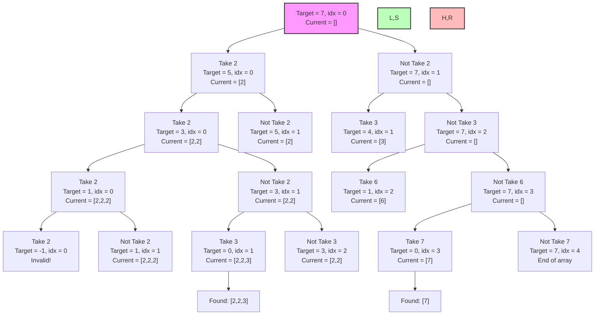

# Combination Sum I: Comprehensive Notes

## Problem Description

**Combination Sum I** is a classic backtracking problem that asks:

> Given an array of **distinct positive integers** `candidates` and a target integer `target`, return a list of all **unique combinations** of `candidates` where the chosen numbers sum to `target`. You may return the combinations in any order.
> 
> The **same** number from `candidates` may be used **an unlimited number of times** in a combination.

### Example:
- Input: `candidates = [2, 3, 6, 7]`, `target = 7`
- Output: `[[2, 2, 3], [7]]`
- Explanation: 
  - `2 + 2 + 3 = 7` is one valid combination
  - `7 = 7` is another valid combination

## Key Characteristics

1. **Unlimited Use**: Each number can be used multiple times
2. **Distinct Numbers**: The input array contains distinct numbers (no duplicates)
3. **Positive Integers**: All numbers in the input array are positive
4. **All Combinations**: We need to find all valid combinations, not just one

## Approach: "Take or Not Take" Recursion

The solution uses recursion with the "Take or Not Take" approach:
1. At each step, we have two choices for the current element:
   - **Take** the current element (add it to our combination and reduce the target)
   - **Not Take** the current element (skip it and move to the next one)
2. Unlike regular subsequence problems, we can reuse elements, so after taking an element, we can consider it again
3. This creates a decision tree where each path represents a different combination

## "Take or Not Take" Decision Tree

For the example `candidates = [2, 3, 6, 7]` and `target = 7`, the decision tree using the "Take or Not Take" approach can be visualized:



This diagram illustrates:
- The "Take or Not Take" decision at each step
- When we take an element, we stay at the same index (can reuse it)
- When we don't take an element, we move to the next index
- The green nodes show successful combinations found
- The red nodes show invalid paths or array bounds

## Time and Space Complexity

- **Time Complexity**: O(N^(T/M)) where:
  - N is the number of candidates
  - T is the target value
  - M is the minimum value among candidates
- **Space Complexity**: O(T/M) where T/M represents the maximum depth of the recursion tree

## Java Implementation with Take/Not Take Approach

```java
import java.util.ArrayList;
import java.util.List;

public class CombinationSum {
    
    public static void main(String[] args) {
        // Example usage
        int[] candidates = {2, 3, 6, 7};
        int target = 7;
        
        List<List<Integer>> result = combinationSum(candidates, target);
        
        System.out.println("Input: candidates = [2,3,6,7], target = 7");
        System.out.println("Output: " + result);
        
        // Another example
        int[] candidates2 = {2, 3, 5};
        int target2 = 8;
        
        List<List<Integer>> result2 = combinationSum(candidates2, target2);
        
        System.out.println("\nInput: candidates = [2,3,5], target = 8");
        System.out.println("Output: " + result2);
    }
    
    /**
     * Find all unique combinations in candidates where the candidate numbers sum to target
     * using the "Take or Not Take" approach.
     * 
     * @param candidates Array of distinct positive integers
     * @param target Target sum to achieve
     * @return List of all unique combinations that sum to target
     */
    public static List<List<Integer>> combinationSum(int[] candidates, int target) {
        List<List<Integer>> result = new ArrayList<>();
        List<Integer> currentCombination = new ArrayList<>();
        
        takeOrNotTake(0, candidates, target, currentCombination, result);
        
        return result;
    }
    
    /**
     * Recursive helper using the "Take or Not Take" approach
     * 
     * @param index Current index in the candidates array
     * @param candidates Array of distinct integers
     * @param target Remaining target to achieve
     * @param current Current combination being built
     * @param result List to store all valid combinations
     */
    private static void takeOrNotTake(int index, int[] candidates, int target, 
                                    List<Integer> current, List<List<Integer>> result) {
        // Base case: Found a combination that sums to target
        if (target == 0) {
            result.add(new ArrayList<>(current));
            return;
        }
        
        // Base case: Target became negative or reached end of array
        if (target < 0 || index >= candidates.length) {
            return;
        }
        
        // Decision 1: Take the current element
        // We can reuse the same element, so we stay at the same index
        current.add(candidates[index]);
        takeOrNotTake(index, candidates, target - candidates[index], current, result);
        
        // Backtrack
        current.remove(current.size() - 1);
        
        // Decision 2: Not take the current element
        // Move to the next element
        takeOrNotTake(index + 1, candidates, target, current, result);
    }
    
    /**
     * Alternative implementation using the conventional for-loop approach
     * (This is often used in practice and is slightly more intuitive for many problems)
     */
    public static List<List<Integer>> combinationSumAlternative(int[] candidates, int target) {
        List<List<Integer>> result = new ArrayList<>();
        backtrack(0, candidates, target, new ArrayList<>(), result);
        return result;
    }
    
    private static void backtrack(int start, int[] candidates, int target, 
                                List<Integer> current, List<List<Integer>> result) {
        if (target == 0) {
            result.add(new ArrayList<>(current));
            return;
        }
        
        if (target < 0) {
            return;
        }
        
        for (int i = start; i < candidates.length; i++) {
            current.add(candidates[i]);
            // Pass i (not i+1) to allow reuse of the same element
            backtrack(i, candidates, target - candidates[i], current, result);
            current.remove(current.size() - 1);
        }
    }
}
```

## Execution Trace with Take/Not Take Approach

Let's trace through the execution of our Take/Not Take approach with `candidates = [2, 3]` and `target = 5`:

1. Call `takeOrNotTake(0, candidates, 5, [], result)`
   - Decision 1: Take element at index 0 (value 2)
     - Add 2 to current: `[2]`
     - Call `takeOrNotTake(0, candidates, 3, [2], result)`
       - Decision 1.1: Take element at index 0 again
         - Add 2 to current: `[2, 2]`
         - Call `takeOrNotTake(0, candidates, 1, [2, 2], result)`
           - Decision 1.1.1: Take element at index 0 again
             - Add 2 to current: `[2, 2, 2]`
             - Call `takeOrNotTake(0, candidates, -1, [2, 2, 2], result)`
             - Target < 0, return (invalid)
             - Remove 2, current: `[2, 2]`
           - Decision 1.1.2: Not take element at index 0
             - Call `takeOrNotTake(1, candidates, 1, [2, 2], result)`
               - Decision 1.1.2.1: Take element at index 1 (value 3)
                 - Add 3 to current: `[2, 2, 3]`
                 - Call `takeOrNotTake(1, candidates, -2, [2, 2, 3], result)`
                 - Target < 0, return (invalid)
                 - Remove 3, current: `[2, 2]`
               - Decision 1.1.2.2: Not take element at index 1
                 - Call `takeOrNotTake(2, candidates, 1, [2, 2], result)`
                 - Index out of bounds, return
             - Return to 1.1.2
         - Remove 2, current: `[2]`
       - Decision 1.2: Not take element at index 0
         - Call `takeOrNotTake(1, candidates, 3, [2], result)`
           - Decision 1.2.1: Take element at index 1 (value 3)
             - Add 3 to current: `[2, 3]`
             - Call `takeOrNotTake(1, candidates, 0, [2, 3], result)`
             - Target == 0, add `[2, 3]` to result
             - Remove 3, current: `[2]`
           - Decision 1.2.2: Not take element at index 1
             - Call `takeOrNotTake(2, candidates, 3, [2], result)`
             - Index out of bounds, return
         - Return to 1.2
     - Remove 2, current: `[]`
   - Decision 2: Not take element at index 0
     - Call `takeOrNotTake(1, candidates, 5, [], result)`
       - Decision 2.1: Take element at index 1 (value 3)
         - Add 3 to current: `[3]`
         - Call `takeOrNotTake(1, candidates, 2, [3], result)`
           - Decision 2.1.1: Take element at index 1 again
             - Add 3 to current: `[3, 3]`
             - Call `takeOrNotTake(1, candidates, -1, [3, 3], result)`
             - Target < 0, return (invalid)
             - Remove 3, current: `[3]`
           - Decision 2.1.2: Not take element at index 1
             - Call `takeOrNotTake(2, candidates, 2, [3], result)`
             - Index out of bounds, return
         - Remove 3, current: `[]`
       - Decision 2.2: Not take element at index 1
         - Call `takeOrNotTake(2, candidates, 5, [], result)`
         - Index out of bounds, return

Final result: `[[2, 3]]`

## Key Insights for Take/Not Take Approach

1. **Main Differences from Standard Subsequence Problems**:
   - When we "Take" an element, we stay at the same index (to allow reuse)
   - This is unlike regular subsequence problems where we always move to the next index

2. **Two Key Decisions at Each Step**:
   - **Take**: Add the current element and stay at the same index (can reuse)
   - **Not Take**: Skip the current element and move to the next index

3. **Base Cases**:
   - Target becomes 0: We found a valid combination
   - Target becomes negative: Invalid path, backtrack
   - Index exceeds array bounds: No more elements to consider

4. **Advantages of Take/Not Take Approach**:
   - More intuitive structure mirroring the decision tree
   - Clearly separates the two choices at each step
   - Makes it easier to adapt to similar problems with different constraints

5. **Comparison with For-Loop Approach**:
   - Take/Not Take: Binary decision at each step (recursion branches into 2)
   - For-Loop: Consider all elements at each step (branches into N possibilities)
   - Both approaches are valid and produce the same result

## Common Pitfalls and Tips

1. **Remember to Stay at Same Index**: When taking an element, stay at the same index to allow reuse
2. **Don't Forget to Backtrack**: Always remove elements before trying the "Not Take" path
3. **Handle Base Cases Properly**: Check
