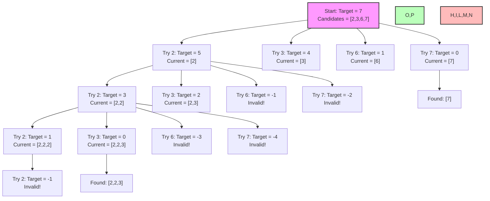

# Combination Sum I: Comprehensive Notes

## Problem Description

**Combination Sum I** is a classic backtracking problem that asks:

> Given an array of **distinct positive integers** `candidates` and a target integer `target`, return a list of all **unique combinations** of `candidates` where the chosen numbers sum to `target`. You may return the combinations in any order.
> 
> The **same** number from `candidates` may be used **an unlimited number of times** in a combination.

### Example:
- Input: `candidates = [2, 3, 6, 7]`, `target = 7`
- Output: `[[2, 2, 3], [7]]`
- Explanation: 
  - `2 + 2 + 3 = 7` is one valid combination
  - `7 = 7` is another valid combination

## Key Characteristics

1. **Unlimited Use**: Each number can be used multiple times
2. **Distinct Numbers**: The input array contains distinct numbers (no duplicates)
3. **Positive Integers**: All numbers in the input array are positive
4. **All Combinations**: We need to find all valid combinations, not just one

## Approach: Backtracking with Decision Tree

The solution uses recursion with backtracking, following a decision tree approach:
1. At each step, we decide whether to:
   - **Take** the current number (and stay at the same index since we can reuse it)
   - **Not take** the current number and move to the next one

## Decision Tree Visualization

For the example `candidates = [2, 3, 6, 7]` and `target = 7`, the decision tree can be visualized using this mermaid diagram:



This diagram shows:
- How we try each candidate at each step
- How the target reduces as we add elements
- The valid combinations found (in green)
- The invalid paths that we prune (in red)

## Time and Space Complexity

- **Time Complexity**: O(N^(T/M)) where:
  - N is the number of candidates
  - T is the target value
  - M is the minimum value among candidates
- **Space Complexity**: O(T/M) where T/M represents the maximum depth of the recursion tree

## Java Implementation

```java
import java.util.ArrayList;
import java.util.List;

public class CombinationSum {
    
    public static void main(String[] args) {
        // Example usage
        int[] candidates = {2, 3, 6, 7};
        int target = 7;
        
        List<List<Integer>> result = combinationSum(candidates, target);
        
        System.out.println("Input: candidates = [2,3,6,7], target = 7");
        System.out.println("Output: " + result);
        
        // Another example
        int[] candidates2 = {2, 3, 5};
        int target2 = 8;
        
        List<List<Integer>> result2 = combinationSum(candidates2, target2);
        
        System.out.println("\nInput: candidates = [2,3,5], target = 8");
        System.out.println("Output: " + result2);
    }
    
    /**
     * Find all unique combinations in candidates where the candidate numbers sum to target.
     * Each number in candidates may be used an unlimited number of times.
     * 
     * @param candidates Array of distinct positive integers
     * @param target Target sum to achieve
     * @return List of all unique combinations that sum to target
     */
    public static List<List<Integer>> combinationSum(int[] candidates, int target) {
        List<List<Integer>> result = new ArrayList<>();
        List<Integer> currentCombination = new ArrayList<>();
        
        // Start the backtracking process
        backtrack(candidates, 0, target, currentCombination, result);
        
        return result;
    }
    
    /**
     * Backtracking helper method to find all combinations
     * 
     * @param candidates Array of candidates
     * @param startIndex Current index to start considering candidates from
     * @param remaining Remaining target sum to achieve
     * @param currentCombination Current combination being built
     * @param result List to store all valid combinations
     */
    private static void backtrack(int[] candidates, int startIndex, int remaining, 
                                 List<Integer> currentCombination, List<List<Integer>> result) {
        
        // Base case 1: Found a valid combination
        if (remaining == 0) {
            result.add(new ArrayList<>(currentCombination)); // Add a deep copy
            return;
        }
        
        // Base case 2: Invalid combination
        if (remaining < 0) {
            return;
        }
        
        // Try each candidate starting from startIndex
        for (int i = startIndex; i < candidates.length; i++) {
            // Add the current candidate to our combination
            currentCombination.add(candidates[i]);
            
            // Recursive call: 
            // - We use i (not i+1) since we can reuse the same element multiple times
            // - We reduce the remaining target by the value of the current candidate
            backtrack(candidates, i, remaining - candidates[i], currentCombination, result);
            
            // Backtrack: remove the last added element to try other combinations
            currentCombination.remove(currentCombination.size() - 1);
        }
    }
    
    /**
     * Optimized version with potential early pruning
     * (Sort the candidates first to potentially exit loops earlier)
     */
    public static List<List<Integer>> combinationSumOptimized(int[] candidates, int target) {
        List<List<Integer>> result = new ArrayList<>();
        List<Integer> currentCombination = new ArrayList<>();
        
        // Sort the candidates (optional optimization)
        // Arrays.sort(candidates);
        
        backtrackOptimized(candidates, 0, target, currentCombination, result);
        
        return result;
    }
    
    private static void backtrackOptimized(int[] candidates, int startIndex, int remaining, 
                                        List<Integer> currentCombination, List<List<Integer>> result) {
        
        if (remaining == 0) {
            result.add(new ArrayList<>(currentCombination));
            return;
        }
        
        for (int i = startIndex; i < candidates.length; i++) {
            // Early pruning: if the current candidate is already greater than the remaining,
            // and if candidates are sorted, we can break the loop
            if (candidates[i] > remaining) {
                break;
            }
            
            currentCombination.add(candidates[i]);
            backtrackOptimized(candidates, i, remaining - candidates[i], currentCombination, result);
            currentCombination.remove(currentCombination.size() - 1);
        }
    }
}
```

## Execution Trace Example

Let's trace through a small example with `candidates = [2, 3]` and `target = 5`:

1. Start: `backtrack(candidates, 0, 5, [], result)`
2. Try first candidate (2):
   - Add 2 to current: `[2]`
   - Call `backtrack(candidates, 0, 3, [2], result)`
   - Try candidate 2 again:
     - Add 2 to current: `[2, 2]`
     - Call `backtrack(candidates, 0, 1, [2, 2], result)`
     - Try candidate 2 again:
       - Add 2 to current: `[2, 2, 2]`
       - Call `backtrack(candidates, 0, -1, [2, 2, 2], result)`
       - Target < 0, return (invalid)
       - Remove 2, current: `[2, 2]`
     - Try candidate 3:
       - Add 3 to current: `[2, 2, 3]`
       - Call `backtrack(candidates, 1, -2, [2, 2, 3], result)`
       - Target < 0, return (invalid)
       - Remove 3, current: `[2, 2]`
     - All candidates tried, return
     - Remove 2, current: `[2]`
   - Try candidate 3:
     - Add 3 to current: `[2, 3]`
     - Call `backtrack(candidates, 1, 0, [2, 3], result)`
     - Target == 0, add `[2, 3]` to result
     - Return
     - Remove 3, current: `[2]`
   - All candidates tried, return
   - Remove 2, current: `[]`
3. Try second candidate (3):
   - Add 3 to current: `[3]`
   - Call `backtrack(candidates, 1, 2, [3], result)`
   - Try candidate 3 again:
     - Add 3 to current: `[3, 3]`
     - Call `backtrack(candidates, 1, -1, [3, 3], result)`
     - Target < 0, return (invalid)
     - Remove 3, current: `[3]`
   - All candidates tried, return
   - Remove 3, current: `[]`
4. All candidates tried, algorithm completes

Final result: `[[2, 3]]`

## Key Insights and Variations

1. **Decision to Reuse Elements**:
   - We pass `i` (not `i+1`) to the recursive call to allow reuse of the same element
   - This is a key difference from subset generation problems

2. **Optimization Techniques**:
   - Sorting the candidates array can enable early pruning
   - We can stop exploring when the remaining target becomes negative

3. **Related Problems**:
   - **Combination Sum II**: Each number can be used only once, and input may contain duplicates
   - **Combination Sum III**: Find combinations of k numbers from 1-9 that sum to a target
   - **Combination Sum IV**: Count the number of possible combinations (order matters)

4. **Alternative Approaches**:
   - Dynamic programming can also solve this problem
   - However, backtracking is more efficient for finding all combinations

## Common Pitfalls

1. Not creating a deep copy when adding to the result list
2. Forgetting to backtrack (remove elements) after recursive calls
3. Incorrectly setting the start index when we want to allow reuse
4. Not handling the base cases properly (when to add to result, when to stop)
